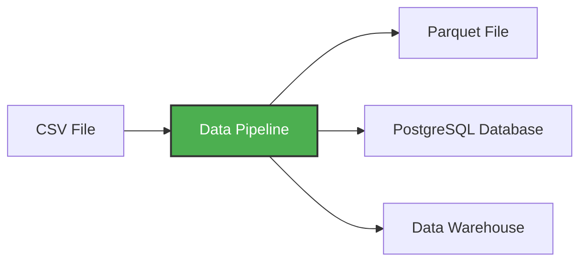

 [[1. Docker Basics|Previous]] | [[3. Running PostgreSQL with Docker|Next]]  


we create a python virtual enviroment using uv 
```bash
uv init --python 3.13
```

to run the python in the env we use 
```bash
uv run python -V
```

Now previously we saw how to create a docker image and we used this command for example 
```bash
docker run -it python:3.13.11-slim
```

but now we want to create our own docker image with our own enviromnet which has pandas and pyarrow and be able to run pipeline.py in it 

so now we will be introduced to DockerFile which is a file contain all the instructions of how exactly we build the docker container, it has all the instruction we need to create the image and from this image create the docker container.
this is an example of the DockerFile:
```js
FROM python:3.13.11-slim

RUN pip install pandas pyarrow

WORKDIR /code

COPY pipeline.py .
```

and in order to build the docker file we use this command 
```bash
docker build -t test:pandas .
```
-t        # stands for tag
test:pandas    # test is the base image name, pandas is the tag
the dot "." the directory where we want to build in

to test it we use the command 
```bash
docker run -it --entrypoint bash --rm test:pandas
```
so now we can run our script using the python in our created container and we see how we will get the parquet file in our directory along side with our pipeline file after we run this command: 
```bash 
root@c2acd89f44c1:/code# python pipeline.py 11
```
but of course we want to manually do that (running the python script) 
that's why we will update our docker file content and add this line
```js
ENTRYPOINT [ "python", "pipeline.py" ]
```
now when building the image we use 
```bash 
 docker build -t test:pandas .
```
and we will see some cached statement and this is good for us because it uses what previously was  build and this make it much faster.
and we test our script using this line 
```bash
docker run -it --rm test:pandas 34
```
the 34 is just the args input 

# So now we created our data pipeline and we dockerized it 

but what about uv ? 
above we used uv to build the env but in the docker file we used pip, so we will remove the pip line and add this line after FROM: 
```js
FROM python:3.13.11-slim
COPY --from=ghcr.io/astral-sh/uv:latest /uv /bin/

WORKDIR /code
COPY "pyproject.toml" ".python-version" "uv.lock" ./

// COPY pipeline.py .
// ENTRYPOINT [ "python", "pipeline.py" ]
```
so now if we rebuild the container and enter it and execute the command ls we will see that we have uv and tmol and uv.lock files in our code folder 
```bash 
docker build -t test:pandas .
docker run -it --rm --entrypoint bash test:pandas
root@fb1d54d1709d:/code# ls
pyproject.toml  uv.lock
root@fb1d54d1709d:/code# uv
An extremely fast Python package manager.
Usage: uv [OPTIONS] <COMMAND>
```

now we will add to the docker file "RUN uv sync --locked" this will install the dependices same ones we have on our env 

so I had this problem that the __init__ file src/ was being copied probely so I had to manually copy it 
then I had another problem with coping the readme.md file for some reason and also copy it manually 
so the docker file content became: 
```js 
FROM python:3.13.11-slim
COPY --from=ghcr.io/astral-sh/uv:latest /uv /bin/
WORKDIR /code
COPY src/ ./src/
COPY "pyproject.toml" ".python-version" "uv.lock" "README.md" ./
RUN uv sync --locked

// COPY pipeline.py .
// ENTRYPOINT [ "python", "pipeline.py" ]
```

so now we install our dependices so now we copy our pipeline.py and add the the entrypoint command 
```js
COPY pipeline.py .
ENTRYPOINT [ "uv", "run", "python", "pipeline.py" ]
```
but instead of us writing "uv" and "run", we will add to our docker file after WORKDIR:
```js
ENV PATH="/app/.venv/bin:$PATH"
```
so when we execute "python" python will come from the path of the uv we add. 
now we can rebuild the container then entering it then executing the command. 
# So for now we have created our first dockerized data pipeline 

 [[1. Docker Basics|Previous]] | [[3. Running PostgreSQL with Docker|Next]]  
